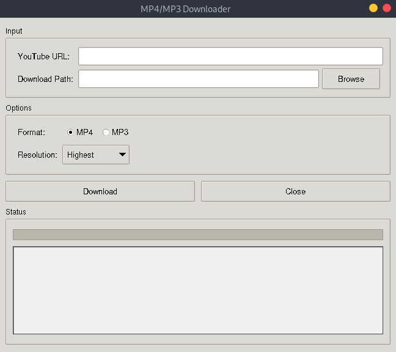
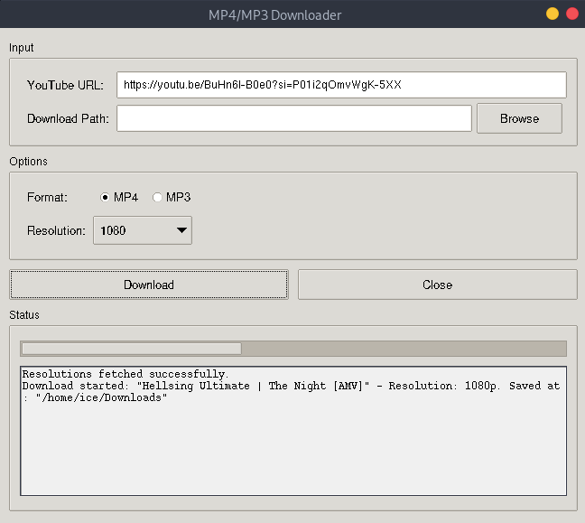
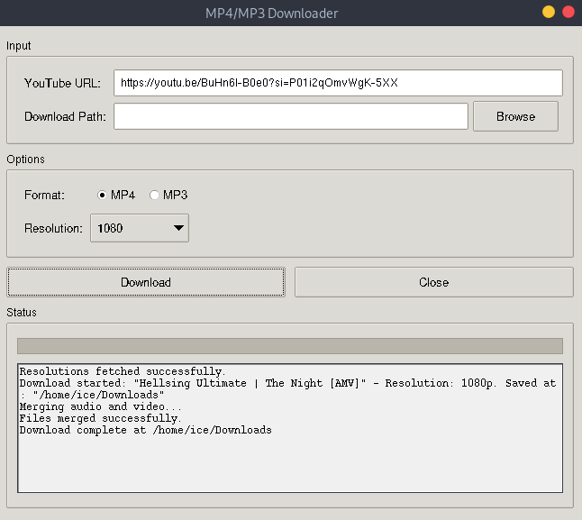

# MP4 & MP3 Downloader

A simple and easy-to-use application for downloading YouTube videos as MP4 or MP3 files.



## Features

- **Download YouTube Videos:** Save videos directly from YouTube.
- **MP4 & MP3 Formats:** Choose between video (MP4) and audio-only (MP3) formats.
- **Resolution Selection:** Select your preferred video resolution.
- **Download Progress:** A progress bar shows the status of your download.
- **Easy to Use:** Simple and intuitive interface.

## How to Use

1. **Enter URL:** Paste the YouTube video URL into the input field.
2. **Choose Format:** Select either MP4 or MP3.
3. **Select Resolution (MP4 only):** If downloading an MP4, choose your desired resolution.
4. **Download:** Click the "Download" button to start.
5. **Choose Save Location (Optional):** By default, files are saved to the ~/Downloads folder. You can select a different location if needed.



## Installation

1. **Clone the repository:**
   ```bash
   git clone https://github.com/PanagopoulosNikolaos/MP4andMP3Converter.git
   ```
2. **Install dependencies:**
   ```bash
   pip install -r requirements.txt
   ```
3. **Run the application:**
   ```bash
   python3 GUI.py
   ```


